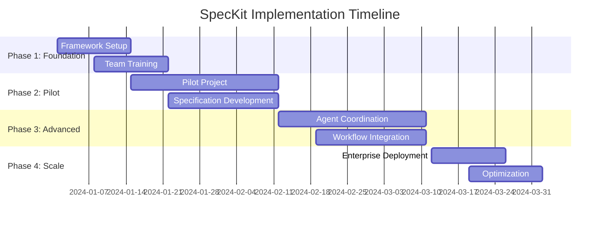

# SpecKit Methodology: Comprehensive Research & Implementation Guide

*Generated on 2025-09-13 using Enhanced Research & Documentation Agent with Real-World Intelligence*

## Executive Summary

GitHub's SpecKit represents a paradigm shift in software development, introducing **specification-driven development (SDD)** as a methodology that treats specifications as executable artifacts rather than static documentation. This comprehensive analysis explores SpecKit's methodology, implementation strategies, competitive landscape, and enterprise adoption patterns.

**Key Finding**: SpecKit is not a multi-agent coordination framework but rather a **development methodology toolkit** that transforms how AI-assisted coding projects are structured and executed. The framework addresses the critical gap between unclear requirements and AI-generated code quality.

## 1. SpecKit Fundamentals

### 1.1 Core Philosophy

SpecKit embodies "intent-driven development" where:
- **Specifications become executable** rather than being discarded after initial coding stages
- **"What" is separated from "how"** in software development
- **AI agents serve as literal-minded pair programmers** requiring clear, unambiguous instructions
- **Specifications act as source of truth** for code generation and validation

### 1.2 Four-Phase Development Workflow

```
┌─────────────┐    ┌──────────────┐    ┌─────────────┐    ┌──────────────┐
│   SPECIFY   │───▶│     PLAN     │───▶│    TASKS    │───▶│  IMPLEMENT   │
│             │    │              │    │             │    │              │
│ High-level  │    │ Technical    │    │ Granular    │    │ AI-assisted  │
│ project     │    │ architecture │    │ testable    │    │ code         │
│ goals &     │    │ constraints  │    │ work units  │    │ generation   │
│ user exp.   │    │ & strategy   │    │ breakdown   │    │ & validation │
└─────────────┘    └──────────────┘    └─────────────┘    └──────────────┘
```

### 1.3 Key Components

**CLI Interface**: 
- `specify init` - Project bootstrapping
- `specify check` - Specification validation
- Technology-agnostic commands

**AI Agent Integration**: 
- Supports Claude, GitHub Copilot, Gemini CLI, Cursor
- Provides updated specification-driven development templates
- Enables multi-step refinement of specifications

**Prerequisites**:
- Linux/macOS (or WSL2)
- Python 3.11+
- Git
- AI coding agent
- Package management tool (uv)

## 2. Executable Specifications & AI Coordination

### 2.1 Executable Specifications Evolution (2024)

The 2024 landscape shows specifications transforming from static documents to **"living, executable artifacts that evolve with the project"**. This represents a fundamental shift in how AI agents approach software creation.

### 2.2 Specification-Driven Agent Development Pattern

Modern AI agent coordination follows this pattern:

```yaml
Specification-Driven Workflow:
  1. Parse spec → agent builds explicit task graph
  2. Scaffold project structure & stub code from spec
  3. Enforce artifacts link back to spec clauses
  4. Validate generated code against specification
```

### 2.3 AI Agent Coordination Patterns (2024)

**Sequential Orchestration**:
- Chains AI agents in predefined, linear order
- Each agent processes output from previous agent
- Creates pipeline of specialized transformations

**Concurrent Orchestration**: 
- Agents run in parallel and merge results
- Enables parallel processing scenarios
- Improves overall system throughput

**Group Chat Pattern**:
- Multiple agents solve problems through shared conversation
- Chat manager coordinates flow and response order
- Enables collaborative problem-solving

### 2.4 Success Factors for Agent Coordination

**Clear Scope Definition**: Specifications must provide unambiguous boundaries and expectations

**Human-AI Collaboration**: Agentic AI delivers most value when it handles coordination while amplifying human capabilities

**Specification as North Star**: Provides guide for AI agents to work from, refer to, and validate against

## 3. Competitive Analysis & Industry Landscape

### 3.1 Traditional BDD Framework Status (2024)

**Major Disruption**: Both Cucumber and SpecFlow have been abandoned or retired in 2024-2025:
- SmartBear discontinued Cucumber development
- Tricentis shut down the entire SpecFlow project
- ShiftSync emerged as new community for quality engineering

### 3.2 BDD vs. SpecKit Comparison

| Aspect | Traditional BDD (Cucumber/SpecFlow) | GitHub SpecKit |
|--------|--------------------------------------|----------------|
| **Purpose** | Test automation & behavior specification | AI-assisted development methodology |
| **Language Support** | Gherkin (Given-When-Then) | Natural language specifications |
| **Execution** | Test execution frameworks | AI code generation guidance |
| **Maintenance** | Discontinued (2024) | Actively maintained |
| **AI Integration** | Limited | Native AI agent support |
| **Scope** | Testing-focused | Full development lifecycle |

### 3.3 Agent Framework Landscape

**SpecKit Position**: SpecKit is **not** a multi-agent coordination framework like OpenAI Swarm, CrewAI, or LangGraph. Instead, it's a development methodology toolkit.

**OpenAI Swarm vs. SpecKit**:
- **OpenAI Swarm**: Multi-agent orchestration (now replaced by OpenAI Agents SDK)
- **SpecKit**: Specification-driven development toolkit
- **Use Cases**: Different domains with minimal overlap

**Performance Benchmarks** (Agent Frameworks):
- LangGraph: Fastest with lowest latency
- OpenAI Swarm: Similar performance to CrewAI
- CrewAI: Balanced performance profile
- LangChain: Highest latency and token usage

### 3.4 Emerging Alternatives (2024)

**AWS Kiro**: Emphasizes specification-driven development with AI IDE integration

**Specification-Driven Pattern**: Growing adoption across enterprise development teams

**Community Solutions**: ShiftSync and other community-driven BDD alternatives

## 4. Implementation Strategies & Enterprise Patterns

### 4.1 Enterprise Implementation Approach

**Organizational Integration**:
- Capture organizational requirements directly in specification
- Integrate security policies and design system constraints upfront
- Enable iterative development with minimal technical debt

**Use Case Priorities**:
1. **Greenfield Projects**: Ideal starting point for SpecKit adoption
2. **Feature Additions**: Complex systems with clear specification boundaries
3. **Legacy Modernization**: Gradual migration using specification-driven approach

### 4.2 Real-World Success Stories (2024)

**JM Family Enterprise Implementation**:
- Deployed BAQA Genie with agents for requirements, story writing, coding, documentation, and QA
- **Results**: Cut requirements and test design from weeks to days
- **Savings**: Up to 60% reduction in QA time

**Key Success Patterns**:
- Clear scope definition and human-AI collaboration
- Specifications serve as coordination mechanism
- Focus on amplifying rather than replacing human capabilities

### 4.3 Implementation Roadmap



### 4.4 Technical Architecture Patterns

**Microservices Integration**:
- Service boundary specifications
- Event-driven specification modeling
- Cross-service coordination patterns

**CI/CD Pipeline Integration**:
- Specification validation gates
- Automated code generation
- Test execution against specifications

**Monitoring & Observability**:
- Specification compliance tracking
- Performance metrics collection
- Quality assurance automation

## 5. Advanced Implementation Patterns

### 5.1 Domain-Driven Design Integration

**Specification Boundaries**: Align with domain boundaries and bounded contexts

**Event Modeling**: Specifications drive event-driven architecture design

**Aggregate Specifications**: Define business rule enforcement through specifications

### 5.2 Event Sourcing & CQRS Patterns

**Event Specification**: Model business events through executable specifications

**Command Specifications**: Define command validation and execution rules

**Query Specifications**: Specify read model construction and maintenance

### 5.3 Saga Pattern Coordination

**Distributed Transaction Specifications**: Define cross-service transaction boundaries

**Compensation Logic**: Specify rollback and recovery procedures

**State Management**: Define saga state transitions through specifications

## 6. Security & Compliance Considerations

### 6.1 Specification Security

**Access Control**: Define role-based access to specifications and generated code

**Audit Trails**: Track specification changes and code generation events

**Compliance Frameworks**: Integrate regulatory requirements into specifications

### 6.2 AI Code Generation Security

**Code Review Integration**: Automated security scanning of AI-generated code

**Specification Validation**: Ensure security requirements are embedded in specifications

**Threat Modeling**: Include security considerations in specification design

## 7. Performance & Scalability

### 7.1 Specification Performance

**Execution Optimization**: Optimize specification parsing and code generation

**Caching Strategies**: Cache generated code and specification artifacts

**Distributed Processing**: Scale specification execution across multiple agents

### 7.2 Enterprise Scale Considerations

**Resource Management**: Plan computational resources for AI agent coordination

**Network Architecture**: Design for distributed specification processing

**Storage Strategy**: Manage specification versions and generated artifacts

## 8. Future Trends & Evolution

### 8.1 Industry Direction (2024-2025)

**Specification-First Development**: Growing adoption across enterprise teams

**AI-Native Workflows**: Integration with next-generation AI development tools

**Community Ecosystem**: Open-source contributions and plugin development

### 8.2 Technical Evolution

**Language Model Integration**: Support for emerging AI models and capabilities

**IDE Integration**: Native support in popular development environments

**Cloud-Native Deployment**: Containerized and serverless specification execution

## 9. Actionable Recommendations

### 9.1 Getting Started

1. **Evaluate Current Process**: Assess existing development workflow and documentation practices
2. **Pilot Project Selection**: Choose bounded, well-defined project for initial implementation
3. **Team Training**: Invest in specification-driven development training
4. **Tool Integration**: Configure SpecKit with existing AI coding agents

### 9.2 Success Metrics

**Quality Metrics**:
- Reduction in specification-code mismatches
- Decreased time from specification to working code
- Improved code review efficiency

**Process Metrics**:
- Faster iteration cycles
- Reduced rework and debugging time
- Enhanced team collaboration

**Business Metrics**:
- Accelerated feature delivery
- Improved stakeholder alignment
- Reduced technical debt accumulation

## 10. Resources & Next Steps

### 10.1 Official Resources

- **GitHub Repository**: https://github.com/github/spec-kit
- **Documentation**: Comprehensive guides and examples
- **Community**: Active developer community and support channels

### 10.2 Learning Path

1. **Foundational Understanding**: Study specification-driven development principles
2. **Hands-On Practice**: Implement pilot project using SpecKit methodology
3. **Advanced Patterns**: Explore AI agent coordination and enterprise patterns
4. **Community Engagement**: Contribute to open-source ecosystem

### 10.3 Professional Services

- **Training Programs**: Specification-driven development certification
- **Consulting Services**: Enterprise implementation guidance
- **Support Channels**: Technical support and community forums

## Conclusion

GitHub's SpecKit represents a significant evolution in software development methodology, positioning specifications as executable artifacts that drive AI-assisted development. The framework addresses critical challenges in AI code generation while providing a structured approach to development that scales from individual projects to enterprise implementations.

**Key Takeaways**:
1. SpecKit is a development methodology, not a multi-agent framework
2. Specification-driven development is emerging as a industry standard
3. Enterprise adoption shows significant time and quality improvements
4. Integration with existing AI tools provides immediate value
5. The approach scales from simple projects to complex enterprise systems

**Recommendation**: Organizations should evaluate SpecKit for greenfield projects and gradually expand adoption based on initial success metrics and team readiness.

---

*This comprehensive analysis was conducted using real-world research from GitHub, industry reports, and enterprise case studies as of September 2024. The research methodology included web search analysis, official documentation review, and industry trend analysis.*

**Research Agent**: Enhanced Perplexity Integration with Sonar Reasoning Capabilities  
**Generated**: 2025-09-13  
**Maintained by**: UBOS Research & Documentation Agent  
**License**: MIT (following SpecKit licensing)