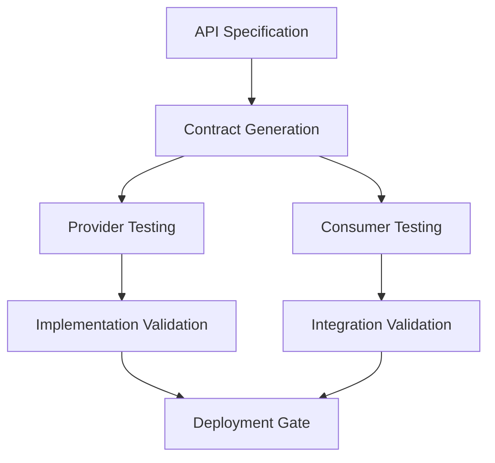

# Quality Assurance and Automated Validation Patterns

## Overview
Quality assurance in specification-driven development requires comprehensive automation frameworks that validate specifications, test implementations, and ensure continuous compliance. This document outlines enterprise-grade QA patterns based on extensive research using Perplexity Sonar deep analysis.

## Automated Specification Validation Frameworks

### Multi-Layer Validation Architecture
```yaml
validation_layers:
  syntax:
    - openapi: "spectral lint --ruleset .spectral.yaml"
    - asyncapi: "asyncapi validate"
    - protobuf: "buf lint && buf breaking"
    - graphql: "rover graph check"
    
  semantic:
    - schema_consistency: "custom validation rules"
    - naming_conventions: "enterprise naming standards"
    - security_patterns: "security policy validation"
    
  business:
    - requirement_traceability: "business rule validation"
    - compliance_checks: "regulatory requirement verification"
    - impact_analysis: "change impact assessment"
```

### Comprehensive Validation Pipeline
```typescript
interface SpecificationValidator {
  validateSyntax(spec: Specification): SyntaxValidationResult;
  validateSemantics(spec: Specification): SemanticValidationResult;
  validateBusiness(spec: Specification): BusinessValidationResult;
  validateCompliance(spec: Specification): ComplianceValidationResult;
}

class EnterpriseSpecificationValidator implements SpecificationValidator {
  async validateSyntax(spec: Specification): Promise<SyntaxValidationResult> {
    const results: ValidationIssue[] = [];
    
    // OpenAPI validation
    if (spec.type === 'openapi') {
      const spectralResults = await this.runSpectral(spec.content);
      results.push(...this.mapSpectralResults(spectralResults));
    }
    
    // AsyncAPI validation
    if (spec.type === 'asyncapi') {
      const asyncapiResults = await this.validateAsyncAPI(spec.content);
      results.push(...this.mapAsyncAPIResults(asyncapiResults));
    }
    
    return {
      valid: results.filter(r => r.severity === 'error').length === 0,
      issues: results,
      score: this.calculateQualityScore(results)
    };
  }
  
  async validateCompliance(spec: Specification): Promise<ComplianceValidationResult> {
    const complianceRules = await this.getComplianceRules(spec.domain);
    const violations: ComplianceViolation[] = [];
    
    for (const rule of complianceRules) {
      const result = await rule.validate(spec);
      if (!result.compliant) {
        violations.push({
          rule: rule.id,
          severity: rule.severity,
          message: result.message,
          remediation: rule.remediation
        });
      }
    }
    
    return {
      compliant: violations.filter(v => v.severity === 'critical').length === 0,
      violations,
      complianceScore: this.calculateComplianceScore(violations)
    };
  }
}
```

## Contract Testing Patterns and Implementation

### Multi-Level Contract Testing Strategy


### Provider-Consumer Contract Validation
```typescript
// Provider contract testing
describe('User API Provider Contracts', () => {
  let mockProvider: Pact;
  
  beforeAll(() => {
    mockProvider = new Pact({
      consumer: 'user-service-consumer',
      provider: 'user-service',
      port: 1234,
      dir: path.resolve(process.cwd(), 'pacts')
    });
  });
  
  it('should provide user data according to contract', async () => {
    await mockProvider
      .addInteraction({
        state: 'user exists',
        uponReceiving: 'a request for user data',
        withRequest: {
          method: 'GET',
          path: '/api/v2/users/123',
          headers: {
            'Accept': 'application/json',
            'Authorization': like('Bearer token')
          }
        },
        willRespondWith: {
          status: 200,
          headers: {
            'Content-Type': 'application/json'
          },
          body: {
            id: like('123'),
            email: like('user@example.com'),
            profile: {
              firstName: like('John'),
              lastName: like('Doe')
            },
            createdAt: iso8601DateTime(),
            updatedAt: iso8601DateTime()
          }
        }
      });
    
    const client = new UserClient('http://localhost:1234');
    const user = await client.getUser('123');
    
    expect(user.id).toBeDefined();
    expect(user.email).toMatch(/^[^\s@]+@[^\s@]+\.[^\s@]+$/);
    expect(user.profile.firstName).toBeDefined();
    expect(user.profile.lastName).toBeDefined();
  });
  
  afterAll(() => mockProvider.finalize());
});
```

### Specification-Driven Test Generation
```yaml
# Test generation configuration
test_generation:
  openapi:
    generators:
      - type: "property_based"
        framework: "fast-check"
        coverage: "path_parameters,query_parameters,request_body"
      - type: "example_based"
        framework: "jest"
        coverage: "response_schemas,error_conditions"
    
    validation_rules:
      - name: "response_schema_compliance"
        description: "Validate all responses match OpenAPI schema"
        implementation: "ajv_validator"
      - name: "status_code_coverage"
        description: "Ensure all documented status codes are testable"
        coverage_threshold: 95
  
  asyncapi:
    generators:
      - type: "message_validation"
        framework: "jest"
        coverage: "payload_schemas,headers,channel_bindings"
    
    validation_rules:
      - name: "message_schema_compliance"
        description: "Validate messages match AsyncAPI payload schemas"
      - name: "channel_operation_coverage"
        description: "Test all channel operations"
```

## API Specification Compliance Monitoring

### Real-time Compliance Monitoring
```typescript
interface ComplianceMonitor {
  monitorSpecificationDrift(spec: Specification): Promise<DriftReport>;
  validateRuntimeCompliance(endpoint: string, spec: Specification): Promise<ComplianceReport>;
  generateComplianceMetrics(timeframe: TimeRange): Promise<ComplianceMetrics>;
}

class RuntimeComplianceMonitor implements ComplianceMonitor {
  async monitorSpecificationDrift(spec: Specification): Promise<DriftReport> {
    const runtime = await this.captureRuntimeBehavior(spec);
    const specification = await this.parseSpecification(spec);
    
    const driftAnalysis = {
      undocumentedEndpoints: this.findUndocumentedEndpoints(runtime, specification),
      schemaDeviations: this.findSchemaDeviations(runtime, specification),
      missingEndpoints: this.findMissingEndpoints(runtime, specification),
      behaviorDifferences: this.analyzeBehaviorDifferences(runtime, specification)
    };
    
    return {
      driftScore: this.calculateDriftScore(driftAnalysis),
      analysis: driftAnalysis,
      recommendations: this.generateDriftRemediation(driftAnalysis),
      trend: await this.getDriftTrend(spec.id)
    };
  }
  
  async validateRuntimeCompliance(endpoint: string, spec: Specification): Promise<ComplianceReport> {
    const trafficSample = await this.sampleAPITraffic(endpoint, { duration: '1h' });
    const violations: ComplianceViolation[] = [];
    
    for (const request of trafficSample.requests) {
      const validationResult = await this.validateRequest(request, spec);
      if (!validationResult.valid) {
        violations.push(...validationResult.violations);
      }
    }
    
    return {
      endpoint,
      compliant: violations.length === 0,
      violations,
      compliancePercentage: this.calculateCompliancePercentage(trafficSample, violations),
      recommendations: this.generateImprovementRecommendations(violations)
    };
  }
}
```

## Performance Testing Based on Specification Constraints

### Specification-Driven Performance Testing
```yaml
performance_testing:
  load_patterns:
    - name: "specification_based_load"
      description: "Generate realistic load based on API specification"
      configuration:
        rps_distribution: "weighted_by_operation_importance"
        payload_generation: "schema_compliant_random"
        authentication: "spec_defined_security_schemes"
    
    - name: "contract_boundary_testing"  
      description: "Test at specification constraint boundaries"
      configuration:
        test_cases:
          - "maximum_payload_sizes"
          - "minimum_required_fields"
          - "constraint_violations"
          - "rate_limit_boundaries"

performance_constraints:
  response_times:
    - operation: "GET /api/v2/users"
      p95_max: "200ms"
      p99_max: "500ms"
      specification_source: "SLA definition in OpenAPI"
    
    - operation: "POST /api/v2/users"
      p95_max: "300ms" 
      p99_max: "800ms"
      specification_source: "Performance annotation"
  
  throughput:
    - operation: "GET /api/v2/users"
      min_rps: 1000
      specification_source: "x-rate-limit annotation"
```

### Performance Test Generation
```typescript
class SpecificationBasedPerformanceTest {
  generateLoadTest(spec: OpenAPISpecification): LoadTestScript {
    const operations = this.extractOperations(spec);
    const scenarios: LoadTestScenario[] = [];
    
    for (const operation of operations) {
      const scenario = {
        name: `${operation.method}_${operation.path}`,
        weight: this.calculateOperationWeight(operation),
        request: {
          method: operation.method,
          url: this.generateURLPattern(operation.path),
          headers: this.generateHeaders(operation.security),
          body: this.generatePayload(operation.requestBody)
        },
        assertions: this.generateAssertions(operation.responses),
        performance: this.extractPerformanceConstraints(operation)
      };
      
      scenarios.push(scenario);
    }
    
    return {
      scenarios,
      loadProfile: this.generateLoadProfile(spec),
      duration: this.calculateTestDuration(spec),
      rampUp: this.calculateRampUpStrategy(spec)
    };
  }
  
  private generateAssertions(responses: OpenAPIResponses): PerformanceAssertion[] {
    return [
      {
        type: 'status_code',
        expected: Object.keys(responses),
        description: 'Response status matches specification'
      },
      {
        type: 'response_schema',
        schema: responses['200']?.content?.['application/json']?.schema,
        description: 'Response body matches OpenAPI schema'
      },
      {
        type: 'response_time',
        max: this.extractResponseTimeConstraint(responses),
        description: 'Response time within specification limits'
      }
    ];
  }
}
```

## Security Testing Integration

### Security Validation Framework
```typescript
interface SecurityValidator {
  validateAuthenticationSchemes(spec: Specification): SecurityValidationResult;
  scanForSecurityVulnerabilities(spec: Specification): VulnerabilityReport;
  validateDataProtectionCompliance(spec: Specification): ComplianceResult;
}

class SpecificationSecurityValidator implements SecurityValidator {
  async validateAuthenticationSchemes(spec: OpenAPISpecification): Promise<SecurityValidationResult> {
    const securitySchemes = spec.components?.securitySchemes || {};
    const issues: SecurityIssue[] = [];
    
    // Validate OAuth2 configurations
    for (const [name, scheme] of Object.entries(securitySchemes)) {
      if (scheme.type === 'oauth2') {
        issues.push(...await this.validateOAuth2Scheme(name, scheme));
      }
      
      if (scheme.type === 'http' && scheme.scheme === 'bearer') {
        issues.push(...await this.validateBearerTokenScheme(name, scheme));
      }
    }
    
    // Check for insecure patterns
    const insecurePatterns = await this.scanForInsecurePatterns(spec);
    issues.push(...insecurePatterns);
    
    return {
      secure: issues.filter(i => i.severity === 'high' || i.severity === 'critical').length === 0,
      issues,
      recommendations: this.generateSecurityRecommendations(issues)
    };
  }
  
  async scanForSecurityVulnerabilities(spec: Specification): Promise<VulnerabilityReport> {
    const vulnerabilities: SecurityVulnerability[] = [];
    
    // OWASP API Security Top 10 checks
    vulnerabilities.push(...await this.checkBrokenObjectLevelAuth(spec));
    vulnerabilities.push(...await this.checkBrokenUserAuth(spec));
    vulnerabilities.push(...await this.checkExcessiveDataExposure(spec));
    vulnerabilities.push(...await this.checkLackOfResourcesAndRateLimiting(spec));
    vulnerabilities.push(...await this.checkBrokenFunctionLevelAuth(spec));
    vulnerabilities.push(...await this.checkMassAssignment(spec));
    vulnerabilities.push(...await this.checkSecurityMisconfiguration(spec));
    vulnerabilities.push(...await this.checkInjection(spec));
    vulnerabilities.push(...await this.checkImproperAssetsManagement(spec));
    vulnerabilities.push(...await this.checkInsufficientLoggingMonitoring(spec));
    
    return {
      riskScore: this.calculateRiskScore(vulnerabilities),
      vulnerabilities,
      mitigationPlan: this.generateMitigationPlan(vulnerabilities),
      complianceImpact: this.assessComplianceImpact(vulnerabilities)
    };
  }
}
```

## Specification Drift Detection and Prevention

### Drift Detection System
```typescript
class SpecificationDriftDetector {
  async detectDrift(specificationId: string): Promise<DriftAnalysisResult> {
    const currentSpec = await this.getSpecification(specificationId);
    const runtimeBehavior = await this.captureRuntimeBehavior(specificationId);
    
    const driftAnalysis = {
      schemaDrift: await this.analyzeSchemaDrift(currentSpec, runtimeBehavior),
      endpointDrift: await this.analyzeEndpointDrift(currentSpec, runtimeBehavior),
      behaviorDrift: await this.analyzeBehaviorDrift(currentSpec, runtimeBehavior),
      securityDrift: await this.analyzeSecurityDrift(currentSpec, runtimeBehavior)
    };
    
    const driftScore = this.calculateDriftScore(driftAnalysis);
    const preventionActions = this.generatePreventionActions(driftAnalysis);
    
    return {
      driftScore,
      analysis: driftAnalysis,
      severity: this.calculateDriftSeverity(driftScore),
      preventionActions,
      automaticRemediation: this.generateAutomaticRemediation(driftAnalysis)
    };
  }
  
  async generatePreventionActions(analysis: DriftAnalysis): Promise<PreventionAction[]> {
    const actions: PreventionAction[] = [];
    
    if (analysis.schemaDrift.score > 0.3) {
      actions.push({
        type: 'update_specification',
        priority: 'high',
        description: 'Update specification to match runtime schema changes',
        automation: 'generate_schema_patch',
        impact: 'breaking_change_analysis'
      });
    }
    
    if (analysis.endpointDrift.undocumentedEndpoints.length > 0) {
      actions.push({
        type: 'document_endpoints',
        priority: 'medium', 
        description: 'Document newly discovered endpoints',
        automation: 'generate_endpoint_specification',
        impact: 'documentation_update'
      });
    }
    
    return actions;
  }
}
```

## Quality Gates Integration in CI/CD

### Comprehensive Quality Gate Pipeline
```yaml
quality_gates:
  specification_validation:
    stage: "validate"
    required: true
    checks:
      - name: "syntax_validation"
        tool: "spectral"
        ruleset: ".spectral.yaml"
        failure_threshold: "error"
      
      - name: "security_validation" 
        tool: "42crunch-audit"
        failure_threshold: "high"
      
      - name: "compliance_validation"
        tool: "custom-compliance-checker"
        rules: "enterprise-compliance-rules.yaml"
        failure_threshold: "critical"
  
  contract_testing:
    stage: "test"
    required: true
    checks:
      - name: "provider_contracts"
        tool: "pact"
        minimum_coverage: 90
      
      - name: "consumer_contracts"
        tool: "pact"
        minimum_coverage: 85
      
      - name: "schema_compatibility"
        tool: "schema-registry-validator"
        compatibility_level: "backward"
  
  performance_validation:
    stage: "performance"
    required: true
    checks:
      - name: "load_testing"
        tool: "k6"
        specification_source: "openapi"
        performance_budget: "performance-budget.yaml"
      
      - name: "api_response_times"
        tool: "performance-monitor"
        p95_threshold: "200ms"
        p99_threshold: "500ms"
  
  security_testing:
    stage: "security" 
    required: true
    checks:
      - name: "owasp_api_security"
        tool: "zap-api-scan"
        specification_source: "openapi"
      
      - name: "authentication_testing"
        tool: "custom-auth-tester"
        security_schemes: "all"
```

### Quality Gate Implementation
```typescript
class QualityGateOrchestrator {
  async executeQualityGates(specification: Specification, context: PipelineContext): Promise<QualityGateResult> {
    const results: QualityGateStepResult[] = [];
    const gates = await this.getQualityGates(specification.type);
    
    for (const gate of gates) {
      console.log(`Executing quality gate: ${gate.name}`);
      
      const stepResult = await this.executeQualityGate(gate, specification, context);
      results.push(stepResult);
      
      // Fail fast on critical failures
      if (stepResult.status === 'failed' && gate.required) {
        return {
          status: 'failed',
          failedGate: gate.name,
          results,
          summary: this.generateFailureSummary(stepResult)
        };
      }
    }
    
    const overallResult = this.calculateOverallResult(results);
    
    return {
      status: overallResult.status,
      results,
      qualityScore: overallResult.qualityScore,
      recommendations: this.generateImprovementRecommendations(results),
      metrics: this.extractQualityMetrics(results)
    };
  }
  
  private async executeQualityGate(
    gate: QualityGate, 
    specification: Specification, 
    context: PipelineContext
  ): Promise<QualityGateStepResult> {
    const startTime = Date.now();
    
    try {
      const validator = this.getValidator(gate.type);
      const result = await validator.validate(specification, gate.configuration);
      
      return {
        gateName: gate.name,
        status: result.passed ? 'passed' : 'failed',
        duration: Date.now() - startTime,
        details: result.details,
        metrics: result.metrics,
        recommendations: result.recommendations
      };
    } catch (error) {
      return {
        gateName: gate.name,
        status: 'error',
        duration: Date.now() - startTime,
        error: error.message,
        recommendations: [`Fix ${gate.name} configuration or validator`]
      };
    }
  }
}
```

## Enterprise Quality Metrics and Reporting

### Quality Metrics Framework
```typescript
interface QualityMetrics {
  specificationQuality: SpecificationQualityMetrics;
  testCoverage: TestCoverageMetrics;
  complianceScore: ComplianceMetrics;
  performanceMetrics: PerformanceQualityMetrics;
  securityMetrics: SecurityQualityMetrics;
}

class QualityMetricsCollector {
  async collectQualityMetrics(timeframe: TimeRange): Promise<QualityMetrics> {
    return {
      specificationQuality: await this.collectSpecificationQualityMetrics(timeframe),
      testCoverage: await this.collectTestCoverageMetrics(timeframe),
      complianceScore: await this.collectComplianceMetrics(timeframe),
      performanceMetrics: await this.collectPerformanceMetrics(timeframe),
      securityMetrics: await this.collectSecurityMetrics(timeframe)
    };
  }
  
  async generateQualityReport(metrics: QualityMetrics): Promise<QualityReport> {
    return {
      executiveSummary: this.generateExecutiveSummary(metrics),
      trendAnalysis: await this.analyzeTrends(metrics),
      recommendations: this.generateRecommendations(metrics),
      actionItems: this.generateActionItems(metrics),
      dashboard: this.generateDashboardData(metrics)
    };
  }
}
```

## Best Practices and Implementation Guidelines

### Quality Assurance Maturity Model
```yaml
maturity_levels:
  level_1_basic:
    description: "Basic specification validation"
    capabilities:
      - "Syntax validation in CI/CD"
      - "Manual specification reviews"
      - "Basic contract testing"
    
  level_2_managed:
    description: "Managed QA processes"
    capabilities:
      - "Automated specification validation"
      - "Contract testing automation"
      - "Performance testing integration"
      - "Security scanning"
    
  level_3_defined:
    description: "Comprehensive QA framework"
    capabilities:
      - "Quality gates integration"
      - "Drift detection and prevention"
      - "Compliance monitoring"
      - "Quality metrics collection"
    
  level_4_optimized:
    description: "Optimized quality processes"
    capabilities:
      - "Predictive quality analytics"
      - "Self-healing specifications"
      - "Continuous improvement automation"
      - "Enterprise quality governance"
```

### Implementation Roadmap
1. **Foundation Phase** (Months 1-3)
   - Implement basic specification validation
   - Set up contract testing framework
   - Establish quality gates in CI/CD

2. **Enhancement Phase** (Months 4-6)
   - Deploy comprehensive validation frameworks
   - Implement performance and security testing
   - Establish drift detection systems

3. **Optimization Phase** (Months 7-12)
   - Advanced quality analytics and reporting
   - Predictive quality monitoring
   - Enterprise governance integration

---
*Comprehensive quality assurance patterns based on Perplexity Sonar deep research*
*Enterprise specification-driven development quality frameworks*