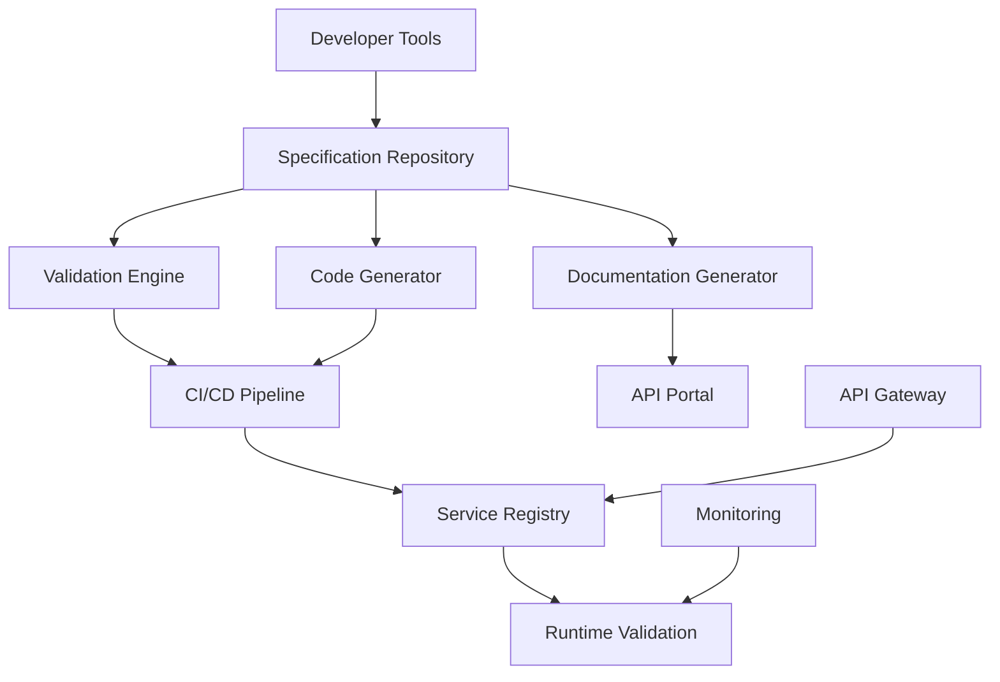

# Modern Specification Framework Integration Patterns

## Overview
Modern specification frameworks form the backbone of enterprise architecture, enabling seamless communication between distributed systems while maintaining consistency and reliability. This document provides comprehensive integration patterns based on deep research using Perplexity Sonar reasoning capabilities.

## Core Framework Analysis

### OpenAPI 3.1+ Advanced Enterprise Patterns

OpenAPI 3.1 introduced significant enhancements including full JSON Schema Draft 2020-12 compatibility, webhook specifications, and improved composition capabilities.

#### Advanced Specification Patterns
```yaml
openapi: 3.1.0
info:
  title: Enterprise User Management API
  version: 2.0.0
  
components:
  schemas:
    BaseEntity:
      type: object
      properties:
        id:
          type: string
          format: uuid
          description: "Unique identifier"
        createdAt:
          type: string
          format: date-time
        updatedAt:
          type: string
          format: date-time
        version:
          type: integer
          description: "Entity version for optimistic locking"
    
    User:
      allOf:
        - $ref: '#/components/schemas/BaseEntity'
        - type: object
          required:
            - email
            - profile
          properties:
            email:
              type: string
              format: email
              description: "User email address"
            profile:
              $ref: '#/components/schemas/UserProfile'
            preferences:
              $ref: '#/components/schemas/UserPreferences'
              
    UserProfile:
      type: object
      required:
        - firstName
        - lastName
      properties:
        firstName:
          type: string
          minLength: 1
          maxLength: 100
        lastName:
          type: string
          minLength: 1
          maxLength: 100
        avatar:
          type: string
          format: uri
          description: "Profile picture URL"
```

#### Enterprise Implementation Strategies
- **Multi-repository specification management** - Teams maintain domain-specific specifications
- **Shared component libraries** - Common schemas and responses across services
- **Specification-first development workflows** - Generate code and tests from specifications
- **Automated documentation generation** - Living documentation that stays current

### AsyncAPI for Event-Driven Architectures

AsyncAPI provides comprehensive specifications for event-driven systems, addressing asynchronous communication complexities.

#### Channel and Message Specifications
```yaml
asyncapi: 3.0.0
info:
  title: User Events API
  version: 1.0.0
  description: User lifecycle events for distributed systems

channels:
  user.lifecycle:
    address: user.lifecycle.{eventType}
    parameters:
      eventType:
        enum: ['created', 'updated', 'deleted', 'activated', 'deactivated']
        description: "Type of user lifecycle event"
    messages:
      userCreated:
        $ref: '#/components/messages/UserCreated'
      userUpdated:
        $ref: '#/components/messages/UserUpdated'
      userDeleted:
        $ref: '#/components/messages/UserDeleted'

components:
  messages:
    UserCreated:
      name: UserCreated
      title: User Created Event
      contentType: application/json
      payload:
        type: object
        required:
          - userId
          - email
          - timestamp
        properties:
          userId:
            type: string
            format: uuid
          email:
            type: string
            format: email
          profile:
            $ref: '#/components/schemas/UserProfile'
          timestamp:
            type: string
            format: date-time
      traits:
        - $ref: '#/components/messageTraits/CommonHeaders'
        
  messageTraits:
    CommonHeaders:
      headers:
        type: object
        properties:
          correlationId:
            type: string
            format: uuid
          source:
            type: string
            description: "Event source service"
          eventVersion:
            type: string
            default: "1.0"
```

#### Microservices Integration Patterns
- **Event catalog management** - Comprehensive documentation of message flows
- **Schema registry integration** - Message evolution with compatibility guarantees
- **Consumer contract validation** - Ensure event handlers match specifications
- **Event sourcing patterns** - Specifications for event store schemas

### JSON Schema Composition and Management

JSON Schema's compositional nature enables modular validation systems and complex validation scenarios.

#### Advanced Composition Patterns
```json
{
  "$schema": "https://json-schema.org/draft/2020-12/schema",
  "title": "Enterprise User Schema",
  "type": "object",
  "allOf": [
    {
      "$ref": "#/$defs/BaseEntity"
    },
    {
      "$ref": "#/$defs/ContactInfo"
    }
  ],
  "if": {
    "properties": {
      "role": {
        "const": "admin"
      }
    }
  },
  "then": {
    "allOf": [
      {
        "$ref": "#/$defs/AdminPermissions"
      },
      {
        "properties": {
          "securityClearance": {
            "type": "string",
            "enum": ["basic", "elevated", "maximum"]
          }
        },
        "required": ["securityClearance"]
      }
    ]
  },
  "$defs": {
    "BaseEntity": {
      "type": "object",
      "properties": {
        "id": {
          "type": "string",
          "format": "uuid"
        },
        "createdAt": {
          "type": "string",
          "format": "date-time"
        },
        "updatedAt": {
          "type": "string",
          "format": "date-time"
        }
      },
      "required": ["id", "createdAt", "updatedAt"]
    },
    "ContactInfo": {
      "type": "object",
      "properties": {
        "email": {
          "type": "string",
          "format": "email"
        },
        "phone": {
          "type": "string",
          "pattern": "^\\+?[1-9]\\d{1,14}$"
        },
        "address": {
          "$ref": "#/$defs/Address"
        }
      },
      "required": ["email"]
    }
  }
}
```

#### Schema Management Strategies
- **Modular schema composition** - Reusable components across applications
- **Reference-based validation** - Shared schema libraries
- **Conditional validation** - Context-aware schema enforcement
- **Schema evolution patterns** - Backward-compatible schema updates

### GraphQL Schema Federation

GraphQL federation enables distributed schema management across multiple services while maintaining unified API surfaces.

#### Federation Architecture
```graphql
# User Service Schema
extend schema
  @link(url: "https://specs.apollo.dev/federation/v2.3",
        import: ["@key", "@external", "@provides", "@requires"])

type User @key(fields: "id") {
  id: ID!
  email: String!
  profile: UserProfile!
  createdAt: DateTime!
}

type UserProfile {
  firstName: String!
  lastName: String!
  avatar: String
  preferences: UserPreferences
}

# Order Service Schema (extends User)
extend schema
  @link(url: "https://specs.apollo.dev/federation/v2.3",
        import: ["@key", "@external", "@provides", "@requires"])

type User @key(fields: "id") {
  id: ID! @external
  orders: [Order!]! @provides(fields: "totalSpent")
  totalSpent: Money! @requires(fields: "id")
}

type Order @key(fields: "id") {
  id: ID!
  userId: ID!
  items: [OrderItem!]!
  total: Money!
  status: OrderStatus!
  createdAt: DateTime!
}

enum OrderStatus {
  PENDING
  CONFIRMED
  SHIPPED
  DELIVERED
  CANCELLED
}
```

#### Federation Coordination Strategies
- **Schema composition validation** - Ensure compatibility before deployment
- **Directive-based relationships** - Maintain referential integrity across services
- **Query planning optimization** - Efficient federated query execution
- **Schema evolution management** - Coordinate changes across federated services

### Protocol Buffers and gRPC Integration

Protocol Buffers provide strongly-typed specifications for high-performance RPC communications with sophisticated evolution capabilities.

#### Advanced Proto Patterns
```protobuf
syntax = "proto3";

package api.user.v2;

import "google/protobuf/timestamp.proto";
import "google/protobuf/empty.proto";
import "validate/validate.proto";
import "common/types.proto";

// User management service
service UserService {
  // Create a new user
  rpc CreateUser(CreateUserRequest) returns (CreateUserResponse) {
    option (google.api.http) = {
      post: "/v2/users"
      body: "user"
    };
  }
  
  // Get user by ID
  rpc GetUser(GetUserRequest) returns (GetUserResponse) {
    option (google.api.http) = {
      get: "/v2/users/{user_id}"
    };
  }
  
  // Stream user updates
  rpc StreamUserUpdates(StreamUserUpdatesRequest) returns (stream UserUpdateEvent);
}

// User entity
message User {
  string id = 1 [
    (validate.rules).string.uuid = true,
    json_name = "userId"
  ];
  
  string email = 2 [
    (validate.rules).string.email = true,
    (validate.rules).string.min_len = 1
  ];
  
  UserProfile profile = 3 [(validate.rules).message.required = true];
  
  google.protobuf.Timestamp created_at = 4 [json_name = "createdAt"];
  google.protobuf.Timestamp updated_at = 5 [json_name = "updatedAt"];
  
  // Optimistic concurrency control
  int64 version = 6;
  
  UserStatus status = 7;
}

message UserProfile {
  string first_name = 1 [
    (validate.rules).string.min_len = 1,
    (validate.rules).string.max_len = 100
  ];
  
  string last_name = 2 [
    (validate.rules).string.min_len = 1,
    (validate.rules).string.max_len = 100
  ];
  
  optional string avatar_url = 3 [
    (validate.rules).string.uri = true
  ];
  
  repeated string tags = 4 [
    (validate.rules).repeated.max_items = 10
  ];
}

enum UserStatus {
  USER_STATUS_UNSPECIFIED = 0;
  USER_STATUS_ACTIVE = 1;
  USER_STATUS_INACTIVE = 2;
  USER_STATUS_SUSPENDED = 3;
}
```

#### Enterprise Integration Patterns
- **Service mesh integration** - Enhanced observability and traffic management
- **Proto evolution strategies** - Maintain backward compatibility
- **Code generation workflows** - Multi-language client generation
- **Validation integration** - Built-in constraint validation

## Cross-Platform Integration Strategies

### Specification Repository Architecture
```typescript
// Unified specification management
interface SpecificationRepository {
  openapi: {
    schemas: OpenAPISchema[];
    validate: (spec: OpenAPISchema) => ValidationResult;
    generate: (spec: OpenAPISchema, target: CodeGenTarget) => GeneratedCode;
  };
  
  asyncapi: {
    schemas: AsyncAPISchema[];
    validate: (spec: AsyncAPISchema) => ValidationResult;
    generate: (spec: AsyncAPISchema, target: MessageGenTarget) => GeneratedCode;
  };
  
  protobuf: {
    schemas: ProtoSchema[];
    validate: (spec: ProtoSchema) => ValidationResult;
    generate: (spec: ProtoSchema, target: ProtoGenTarget) => GeneratedCode;
  };
  
  graphql: {
    schemas: GraphQLSchema[];
    validate: (spec: GraphQLSchema) => ValidationResult;
    federate: (schemas: GraphQLSchema[]) => FederatedSchema;
  };
}
```

### API Versioning and Compatibility

#### Versioning Strategy Matrix
| Framework | Versioning Approach | Compatibility Strategy | Evolution Pattern |
|-----------|-------------------|----------------------|------------------|
| OpenAPI | Path + Header | Semantic versioning | Deprecation workflow |
| AsyncAPI | Schema evolution | Message compatibility | Event versioning |
| GraphQL | Schema evolution | Field deprecation | Federation coordination |
| gRPC | Proto field rules | Wire-format compatibility | Field number management |

#### Backward Compatibility Implementation
```yaml
# OpenAPI Compatibility Pattern
paths:
  /api/v1/users:
    get:
      deprecated: true
      description: "⚠️ Deprecated. Use /api/v2/users instead"
      responses:
        '200':
          headers:
            Sunset:
              schema:
                type: string
                format: date
                example: "2024-12-31"
              description: "API sunset date - plan migration"
            Deprecation:
              schema:
                type: string
                format: date
                example: "2024-06-01"
              description: "Deprecation notice date"
          content:
            application/json:
              schema:
                $ref: '#/components/schemas/UserListV1'
    
  /api/v2/users:
    get:
      summary: "List users (v2)"
      description: "Enhanced user listing with filtering and pagination"
      responses:
        '200':
          content:
            application/json:
              schema:
                $ref: '#/components/schemas/UserListV2'
```

## Modern Tooling Ecosystem

### CI/CD Integration Pipeline
```yaml
# Comprehensive specification validation pipeline
specification-governance:
  stages:
    - validate
    - generate
    - test
    - deploy

validate-specifications:
  stage: validate
  script:
    # OpenAPI validation
    - spectral lint --ruleset .spectral.yaml openapi-specs/**/*.yaml
    # AsyncAPI validation  
    - asyncapi validate asyncapi-specs/**/*.yaml
    # Protocol Buffers validation
    - buf lint proto-specs
    - buf breaking --against '.git#branch=main' proto-specs
    # GraphQL validation
    - rover graph check --schema=federation-schema.graphql

generate-artifacts:
  stage: generate
  script:
    # Generate TypeScript clients
    - openapi-generator generate -i user-api.yaml -g typescript-fetch -o ./generated/user-client
    # Generate Node.js AsyncAPI handlers
    - asyncapi generate fromTemplate user-events.yaml @asyncapi/nodejs-template -o ./generated/event-handlers
    # Generate gRPC clients
    - protoc --ts_out=./generated/grpc --ts_opt=grpc_js --grpc_out=./generated/grpc --grpc_opt=grpc_js proto-specs/*.proto
    # Generate GraphQL types
    - graphql-codegen --config codegen.yml

contract-testing:
  stage: test
  script:
    # OpenAPI contract testing
    - prism mock user-api.yaml & MOCK_PID=$!
    - newman run user-api-tests.postman_collection.json
    - kill $MOCK_PID
    # AsyncAPI message testing
    - npm run test:asyncapi-contracts
    # gRPC service testing
    - grpcurl -plaintext -import-path ./proto-specs -proto user.proto localhost:9000 user.UserService/GetUser
```

### Enterprise Toolchain Architecture


## Best Practices and Implementation Guidelines

### Framework Selection Criteria
1. **Use Case Alignment**: Match framework capabilities to specific requirements
2. **Ecosystem Integration**: Consider existing tooling and platform compatibility
3. **Team Expertise**: Evaluate learning curve and training requirements
4. **Performance Requirements**: Assess performance characteristics and overhead
5. **Evolution Strategy**: Plan for long-term specification evolution and migration

### Quality Assurance Integration
1. **Automated Validation**: Embed specification validation in CI/CD pipelines
2. **Contract Testing**: Verify implementations against specifications
3. **Documentation Currency**: Ensure specifications remain accurate and current
4. **Breaking Change Detection**: Implement automated compatibility checking
5. **Consumer Impact Analysis**: Assess downstream effects of specification changes

### Enterprise Governance
1. **Specification Ownership**: Clear responsibility assignment and accountability
2. **Review Processes**: Structured approval workflows for specification changes
3. **Compliance Integration**: Embed regulatory requirements in specification validation
4. **Metrics and Monitoring**: Track specification quality and adoption metrics
5. **Training and Support**: Comprehensive education and support systems

---
*Comprehensive framework integration patterns based on Perplexity Sonar research*
*Modern specification-driven development for enterprise architectures*